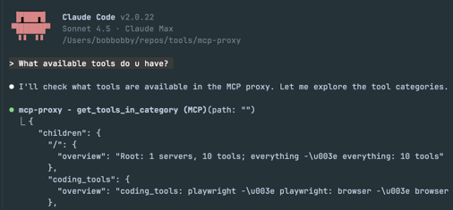
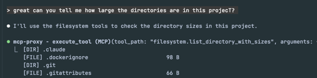

# Lazy MCP
Lazy MCP lets your agent fetch MCP tools only on demand, saving those tokens from polluting your context window.

In [this](https://voicetree.io/blog/lazy-mcp+for+tool+instructions+only+on+demand) example, it saved 17% (34,000 tokens) of an entire claude code context window by hiding 2 MCP tools that aren't always needed.

Welcoming open source contributions!

## How it Works

Lazy MCP exposes two meta tools, which allows agents to explore a tree structure of available MCP tools and categories.


- `get_tools_in_category(path)` - Navigate the tool hierarchy
- `execute_tool(tool_path, arguments)` - Execute tools by path


## Example Flow

```
1. get_tools_in_category("") → {
     "categories": {
       "coding_tools": "Development tools... use when...",
       "web_tools": "description ... instructions"
     }
   }
   
2. get_tools_in_category("coding_tools") → {
     "categories": {
       "serena": "description ... instructions",
     }
   } 

3. get_tools_in_category("coding_tools.serena") → {
     "tools": {"find_symbol": "...", "get_symbols_overview": "..."}
   }

4. execute_tool("coding_tools.serena.find_symbol", {...})
   → Lazy loads Serena server (if not already loaded)
   → Proxies request to Serena
   → Returns result
```



## Quick Start

```bash
make build
```

```bash
./build/structure_generator --config config.json --output testdata/mcp_hierarchy
```

This generates the hierarchical structure in the output folder config.json specifies, by fetching the available tools from the mcp servers specified.


**Add to Claude Code:**
```bash
 claude mcp add --transport stdio mcp-proxy build/mcp-proxy -- --config config.json
```

## Proxy mode

Without a hierarchy (no `mcpProxy.hierarchyPath`, no `-hierarchy`, and `type` other than
`stdio`), lazy-mcp runs as the upstream [TBXark/mcp-proxy](https://github.com/TBXark/mcp-proxy):
it mounts every downstream server's tools, prompts and resources on its own route over SSE or
streamable HTTP. That mode brings the upstream features: OAuth for downstream servers
(`-authorize`), health and readiness endpoints, opt-in auto-reconnect, tool filters, and the
`-check-config`, `-auth-status` and `-doctor` commands. A downstream can also be lazy-loaded
behind a single `activate_<server>` tool with `options.lazyLoad`. See
[docs/USAGE.md](docs/USAGE.md) and [docs/CONFIGURATION.md](docs/CONFIGURATION.md).

## Configuration

### Basic Config Structure

see [config.json](config.json) for an example.

### Tool Hierarchy Structure

Tool hierarchy is defined in `testdata/mcp_hierarchy/` with JSON files:

**Root node** (`testdata/mcp_hierarchy/root.json`):

**Category nodes** (e.g., `testdata/mcp_hierarchy/github/github.json`):

**Tool nodes** (e.g., `testdata/mcp_hierarchy/github/create_issue/create_issue.json`):

## Command Line Options

```bash
./mcp-proxy --help
```

## Permission Control with Claude Code Hooks

When using lazy-mcp with Claude Code, all tool calls go through `execute_tool`. This means traditional MCP permission rules (like `mcp__github__create_issue`) don't apply directly.

To control which tools require permission prompts, use **Claude Code hooks**.

### Option 1: Claude Code Native Hook (Recommended for Claude Code)

Claude Code's `PreToolUse` hooks can inspect the `tool_path` argument and decide permission by outputting JSON:
- **Allow:** Exit 0 (no output)
- **Ask:** Exit 0 with `{"hookSpecificOutput": {"permissionDecision": "ask", ...}}`
- **Deny:** Exit 0 with `{"hookSpecificOutput": {"permissionDecision": "deny", ...}}`

#### Setup

1. **Copy the example hook script:**
   ```bash
   cp examples/hooks/check-sensitive-tools.sh ~/.claude/hooks/
   chmod +x ~/.claude/hooks/check-sensitive-tools.sh
   ```

2. **Configure Claude Code hooks** (in `~/.claude/settings.json` or project `.claude/settings.local.json`):
   ```json
   {
     "hooks": {
       "PreToolUse": [
         {
           "matcher": "mcp__lazy-mcp__execute_tool",
           "hooks": [
             {
               "type": "command",
               "command": "~/.claude/hooks/check-sensitive-tools.sh"
             }
           ]
         }
       ]
     }
   }
   ```

3. **Customize sensitive tools** via environment variables:
   ```bash
   # Tools that require permission prompts
   export LAZY_MCP_SENSITIVE_TOOLS="gmail.send_email,github.create_*,gitlab.create_*"

   # Tools that are completely blocked
   export LAZY_MCP_DENIED_TOOLS="*.force_delete_*"
   ```

### Option 2: Token-Based Hook (Recommended for OpenCode / General Use)

Since not all agents support the `permissionDecision` JSON protocol, `lazy-mcp` also supports a universal "Token Hook" mechanism. This forces the agent to retry the operation after user confirmation.

#### How It Works

1. **First Call:** Hook checks for a token. If missing, it exits with error `CONFIRMATION_NEEDED` and the path to the required token.
2. **Agent Response:** The agent catches this error, asks the user for confirmation, and creates the token file.
3. **Retry:** The agent retries the tool call. The hook finds the token, deletes it (one-time use), and allows execution.

#### Setup

1. **Copy the token hook script:**
   ```bash
   cp examples/hooks/confirm-tool-token.sh /path/to/hooks/
   chmod +x /path/to/hooks/confirm-tool-token.sh
   ```

2. **Configure your agent** to call this script *before* `execute_tool`.

### Option 3: OpenCode Plugin

For OpenCode users, a TypeScript plugin is available that logs warnings for sensitive actions.

```bash
cp examples/plugins/opencode-sensitive-tools.ts .opencode/plugin/sensitive-tools-check.ts
```

### Default Sensitive Tools

The example scripts include sensible defaults for public-facing actions:

| Server | Sensitive Tools |
|--------|-----------------|
| Gmail | `send_email`, `create_draft`, `delete_email`, `trash_email` |
| GitHub | `create_issue`, `create_pull_request`, `create_repository`, `push_files`, `create_or_update_file`, `create_branch`, `fork_repository` |
| GitLab | `create_issue`, `create_merge_request`, `accept_merge_request`, `create_project`, `create_branch`, `create_or_update_file` |

### Pattern Syntax

- **Exact match:** `gmail.send_email`
- **Server prefix:** `gmail.*` (all gmail tools)
- **Suffix match:** `*.delete_*` (all delete operations)

## Credits

Forked from [TBXark/mcp-proxy](https://github.com/TBXark/mcp-proxy) - extended with hierarchical routing, lazy loading, and stdio support.

## License

MIT License - see [LICENSE](LICENSE)
